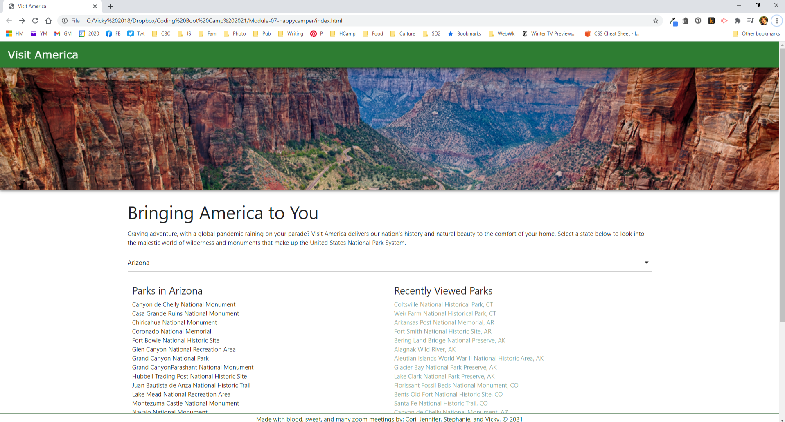
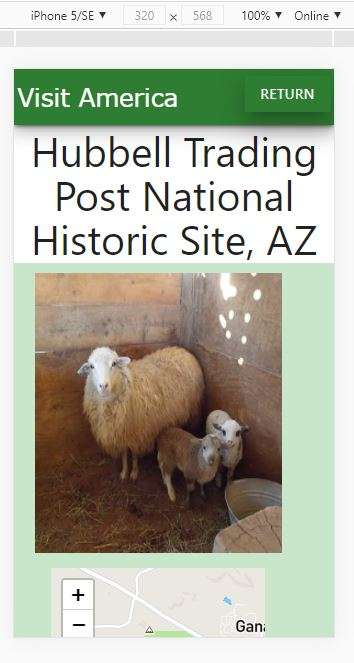
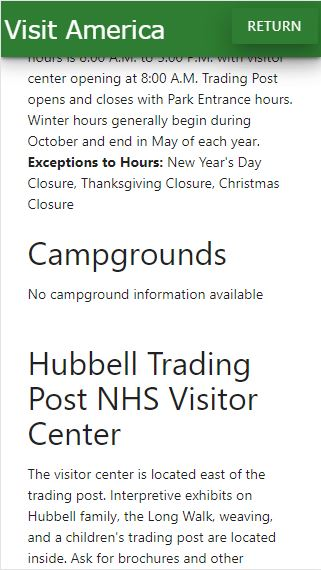
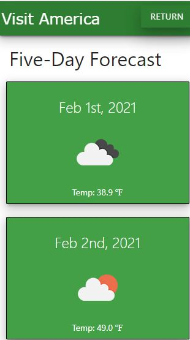

# 07 Group Project: Visit America
## University of Arizona Bootcamp 
### February 3, 2021
Developers:
* [Vicky Loebel](https://github.com/vloebel): Project manager, Design, JavaScript, HTML, CSS, Documentation
* [Stephanie Giel](https://github.com/SGiel): Design, JavaScript, APIs, HTML, CSS
* [Cori Cathemer](https://github.com/coricathemer): Design, HTML, CSS
* [Jennifer Molina](https://github.com/JenMol86): HTML, Testing

application URL: [vloebel.github.io/happycamper](https://sgiel.github.io/visit-america/) 

**Modification History**  

* -- 
## Notes:
repo/application name will be changed from "happy camper" to "Visit America" after class presentation. 

## Overview
Visit America delivers the wonders of the National Park Service by providing information about the national parks and monuments in the united states. Selecting a park displays a page of information about its visitor's center, public campgrounds, and a link to the webcam for that park if one exists. The page also displays the park's five-day weather forecast. The user's most recent searches are saved in local-storage.

## APIs Used
* [National Park Service Developer Resources](https://www.nps.gov/subjects/developer/index.htm)
  * Park information, webcam links
* [Mapbox Maps Service](https://docs.mapbox.com/api/maps/)
  * Map display
* [Open Weather One Call API](https://openweathermap.org/api/one-call-api)
  * five-day forecast based on park lat/long

## Libraries Used
* [Materialize](https://materializecss.com/)
  * HTML/CSS Framework
* [fonts.googleapis](https://fonts.google.com/)
  * Materialize fonts
* [Moment.js](https://momentjs.com/docs/)
  * Date fetch and manipulation
* [jQuery](https://jquery.com/)
  * Materialize initializations
* [font-awesome](https://fontawesome.com/)
  * icon fonts

## Requirements
* Design must be mobile-first and display properly on any size screen
* Viewing the home page presents a short introduction to the application, a  menu for selecting a state, and a list of previously viewed parks if available.
* Selecting a state displays a list of the parks in that state. 
* Clicking a park opens a second web page displaying: 
  * Park name
  * An image taken from the park API 
  * A map generated from the park's latitude and longitude
  * A clickable button that links to the park's webcam 
  * Public campgrounds associated with the park
  * Five-day weather forecast based on the parks' lat & long
* If no data available (for example, no campground information)  
  * Display for that information will be hidden
  * Message indicating there's no information available will be displayed

## Screen Shots
### Desktop UI Main Page

### Page 2: Park Information 
### Top screen shot

### Screen after scrolling down

### Top of page 2 on small screen

### Screen shot of middle of page 2 on small screen

### Weather cards on page 2 small screen

